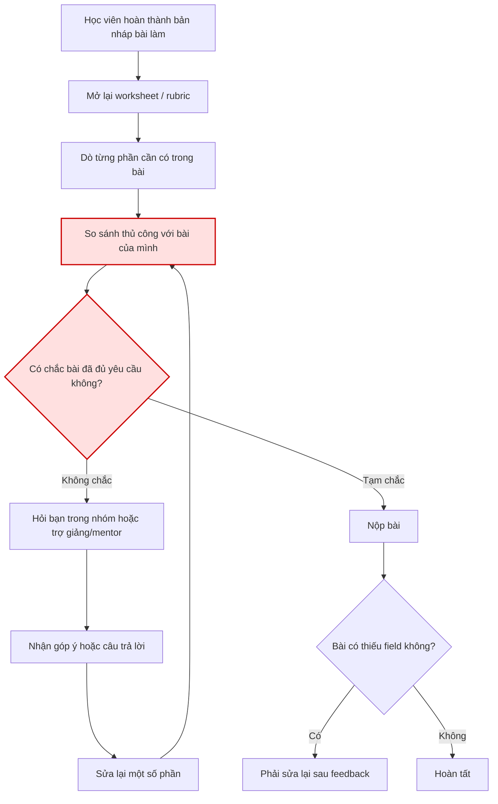
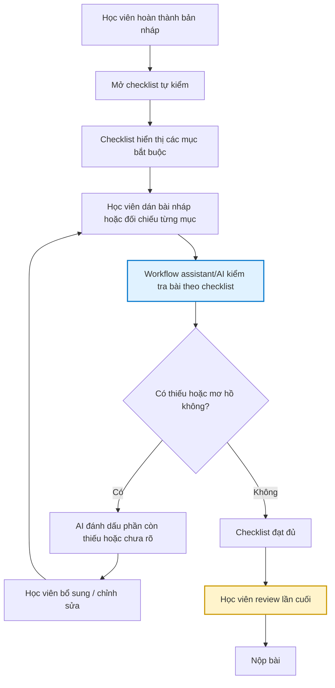
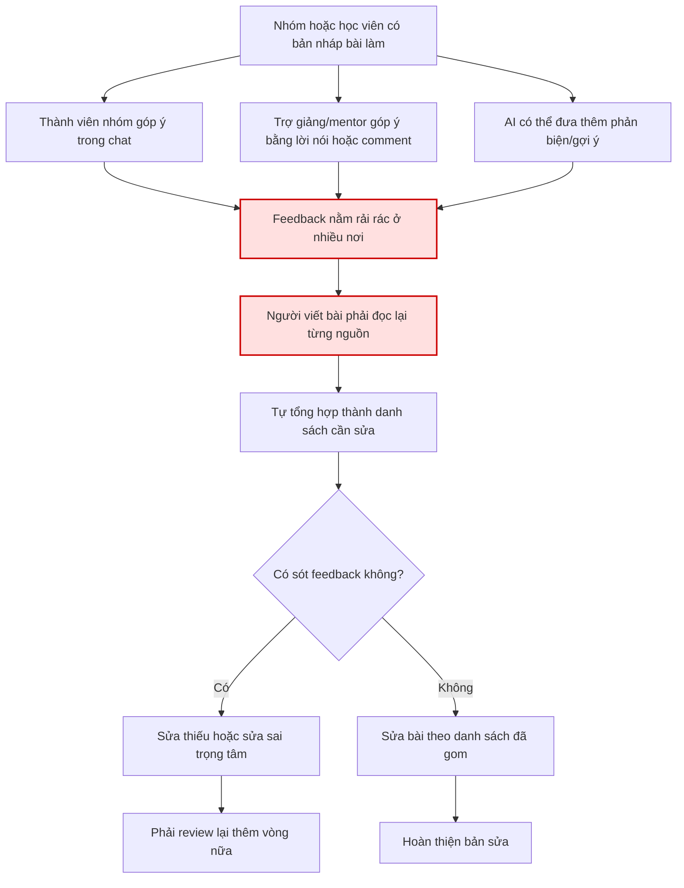
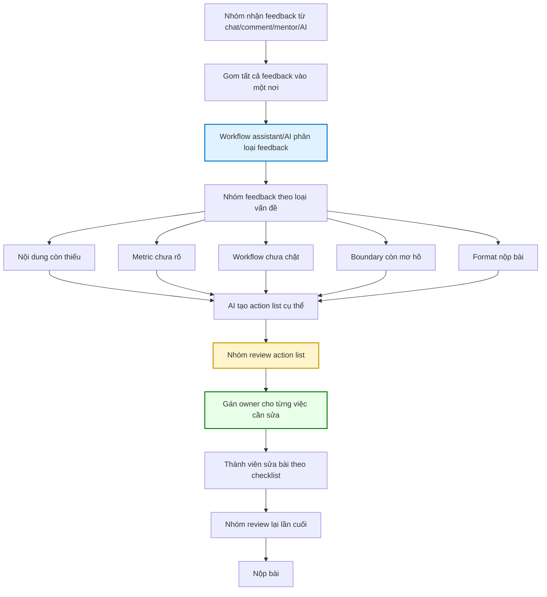

# Day 02 Lab — Worksheet

## Bảng scan

| #   | Lăng kính          | Problem quan sát được                                                                                                                                                                              | Ai đang đau?                            | Dấu hiệu thật                                                                                                                             |
| --- | ------------------ | -------------------------------------------------------------------------------------------------------------------------------------------------------------------------------------------------- | --------------------------------------- | ----------------------------------------------------------------------------------------------------------------------------------------- |
| 1   | Tốn thời gian      | Không có một luồng hướng dẫn chính thức từ đầu đến cuối để làm bài lab; người học phải đọc slide, worksheet, ví dụ mẫu, nhóm chat và lời nhắc của trợ giảng/mentor rồi tự ghép lại thứ tự làm bài. | Học viên, nhóm làm bài                  | Mất khoảng 15–30 phút chỉ để xác định “phải làm gì trước/sau”.                                                                            |
| 2   | Pain từ người khác | Thông tin cập nhật hoặc phần giải thích thêm không có một source of truth duy nhất, nên mỗi người có thể hiểu yêu cầu hơi khác nhau.                                                               | Học viên, nhóm trưởng, trợ giảng/mentor | Trong nhóm thường xuất hiện các câu như “mình tưởng phải làm thế này”, “file kia bảo khác”, “phần này có cần làm không?”.                 |
| 3   | Lặp lại            | Các câu hỏi về format nộp bài, top 3 Problem Cards, workflow trước/sau, repo structure và thứ tự làm bài bị hỏi lại nhiều lần.                                                                     | Học viên, trợ giảng/mentor              | Cùng một câu hỏi như “làm cá nhân trước hay nhóm trước?”, “có cần workflow cho cả 3 problem không?”, “nộp folder nào?” xuất hiện lặp lại. |
| 4   | Tốn thời gian      | Feedback/góp ý trong quá trình làm bài bị phân tán ở nhiều nơi như chat nhóm, comment, lời nói trực tiếp hoặc phản hồi của AI, khiến người làm khó tổng hợp thành danh sách cần sửa.               | Học viên, nhóm viết bài                 | Mất thêm khoảng 10–20 phút để gom lại “rốt cuộc phải sửa những gì”; dễ sót feedback quan trọng.                                           |
| 5   | AI có thể tốt hơn  | Trước khi nộp, người học khó tự kiểm bài đã đủ yêu cầu chưa vì checklist và rubric chưa được chuyển thành một danh sách kiểm tra rõ ràng, dễ dùng.                                                 | Học viên, nhóm nộp bài                  | Dễ thiếu các phần như Problem Card, workflow trước/sau, metric, boundary, Rule/Workflow/Agent hoặc final decision trước khi nộp.          |

Gợi ý cho `Dấu hiệu thật`: mất bao lâu, xảy ra mấy lần/tuần, bao nhiêu người gặp, có log/ticket/review/comment không, nếu không sửa thì hậu quả là gì.

## Nếu dùng AI ở phase này

## Nhận xét sau khi scan

Các problem trên đều xoay quanh quá trình làm bài lab/bài nhóm, nhưng không trùng hoàn toàn với nhau. Mỗi problem nằm ở một điểm nghẽn khác nhau trong workflow:

```text
1. Hiểu luồng làm bài
2. Xác định nguồn thông tin đúng
3. Hỏi lại các yêu cầu lặp lại
4. Tổng hợp feedback trong quá trình sửa bài
5. Tự kiểm bài trước khi nộp

Hãy gợi ý thêm problem theo 4 lăng kính: lặp lại, tốn thời gian, AI có thể tốt hơn, pain từ người khác.
Với mỗi gợi ý, ghi actor, workflow sơ bộ và cách đo.
Đừng đưa ý tưởng quá rộng kiểu "xây trợ lý AI toàn năng".
```

## Reflection — AI hỗ trợ trong phase scan

Tôi dùng AI để gợi ý thêm các problem trong quá trình làm bài lab. Những ý dùng được là: hướng dẫn bị phân tán, câu hỏi về format bị lặp lại, feedback rải rác và khó tự kiểm bài trước khi nộp.

## Tôi bỏ các ý như “xây chatbot toàn năng” hoặc “agent tự quản lý toàn bộ bài lab” vì chúng quá rộng và chưa phải pain thật. Sau khi lọc lại, tôi chọn tập trung vào vấn đề cốt lõi: thông tin và hướng dẫn chưa được thống nhất thành một luồng rõ ràng.

# Phase 2 — Top 3 Problem Cards + Draft Workflow

## Chọn top 3

| Rank | Problem                                                                                                                            | Vì sao chọn                                                                                                                                                                                                                                                            | Điều còn chưa chắc                                                                                                              |
| ---: | ---------------------------------------------------------------------------------------------------------------------------------- | ---------------------------------------------------------------------------------------------------------------------------------------------------------------------------------------------------------------------------------------------------------------------- | ------------------------------------------------------------------------------------------------------------------------------- |
|    1 | Không có một luồng hướng dẫn chính thức từ đầu đến cuối để làm bài lab.                                                            | Đây là problem rõ nhất, ảnh hưởng trực tiếp đến việc học viên hiểu yêu cầu, làm bài cá nhân, chuyển sang bài nhóm và nộp bài đúng format. Actor rõ, workflow có thể vẽ được, bottleneck cụ thể và impact có thể đo bằng thời gian tìm yêu cầu hoặc số câu hỏi lặp lại. | Cần xác định nguồn nào nên được xem là source of truth chính thức: slide, worksheet, README hay thông báo của trợ giảng/mentor. |
|    2 | Trước khi nộp, người học khó tự kiểm bài đã đủ yêu cầu chưa vì checklist/rubric chưa được chuyển thành danh sách kiểm tra dễ dùng. | Problem này có impact trực tiếp đến chất lượng bài nộp. Dễ đo bằng số mục bị thiếu, thời gian tự kiểm và số lần phải sửa lại trước khi nộp.                                                                                                                            | Cần biết lỗi thiếu mục nào xuất hiện nhiều nhất: Problem Card, workflow, metric, boundary, Rule/Workflow/Agent hay reflection.  |
|    3 | Feedback/góp ý trong quá trình làm bài bị phân tán ở nhiều nơi, khó tổng hợp thành danh sách cần sửa.                              | Đây là pain thường gặp khi làm bài nhóm. Nếu feedback không được gom lại rõ ràng, nhóm dễ sửa thiếu, sửa sai trọng tâm hoặc không biết ai chịu trách nhiệm phần nào.                                                                                                   | Cần kiểm chứng feedback thường đến từ nguồn nào nhiều nhất: chat nhóm, comment, mentor, bạn cùng nhóm hay AI.                   |

---

# Problem Card #1 — Không có một luồng hướng dẫn chính thức từ đầu đến cuối để làm bài lab

## Problem 1 câu

Trong quá trình làm bài lab, thông tin hướng dẫn bị phân tán ở nhiều nơi như slide, worksheet, ví dụ mẫu, nhóm chat và lời nhắc của trợ giảng/mentor, khiến học viên khó biết đâu là nguồn chính xác nhất, cần làm bước nào trước/sau và bài nộp cuối cùng phải đủ những gì.

## Actor

Học viên tham gia lab, đặc biệt là những người đang bắt đầu làm phần cá nhân hoặc chuẩn bị chuyển sang phần bài tập nhóm.

Nhóm học viên cần thống nhất cách làm, phân công và nộp bài đúng format.

Trợ giảng/mentor là người phải giải thích lại khi học viên không chắc yêu cầu hoặc hiểu khác nhau.

## Thời điểm / bối cảnh

Vấn đề xuất hiện khi học viên bắt đầu làm bài Day 02 Lab, cần hiểu quy trình từ scan problem cá nhân, chọn top 3 Problem Cards, vẽ workflow trước/sau, sau đó chuyển sang phần nhóm và cuối cùng viết reflection cá nhân.

## Current workflow 3–7 bước

1. Học viên nhận yêu cầu làm bài lab từ buổi học.
2. Học viên đọc nhiều nguồn khác nhau như slide, worksheet, ví dụ mẫu, nhóm chat và lời nhắc của trợ giảng/mentor.
3. Học viên tự ghép lại thứ tự làm bài: cá nhân làm gì trước, nhóm làm gì sau, phần nào cần nộp.
4. Khi không chắc, học viên hỏi lại bạn trong nhóm hoặc hỏi trợ giảng/mentor.
5. Nhóm mất thêm thời gian để thống nhất cùng một cách hiểu.
6. Học viên bắt đầu làm bài nhưng vẫn có nguy cơ thiếu field hoặc làm sai format.
7. Trước khi nộp, học viên phải kiểm tra lại thủ công từ nhiều nguồn để chắc bài đủ yêu cầu.

## Bottleneck

Bottleneck chính nằm ở bước học viên phải tự tổng hợp và xác nhận thông tin đúng từ nhiều nguồn phân tán.

Vấn đề không phải là thiếu tài liệu, mà là thiếu một “source of truth” và một luồng hướng dẫn chính thức từ đầu đến cuối. Khi không có luồng rõ ràng, học viên phải tự đoán thứ tự làm bài, dễ hiểu sai hoặc bỏ sót phần bắt buộc.

## Impact

Học viên mất nhiều thời gian chỉ để hiểu cần làm gì trước/sau thay vì tập trung phân tích problem.

Nhóm dễ hiểu khác nhau về yêu cầu, dẫn đến phân công lệch, làm trùng hoặc thiếu phần.

Trợ giảng/mentor phải trả lời lại các câu hỏi đã có trong tài liệu nhưng học viên không tìm thấy hoặc không chắc.

Bài nộp có nguy cơ thiếu các mục quan trọng như 5 problems, top 3 Problem Cards, workflow trước/sau, success metric, boundary, Rule/Workflow/Agent hoặc final decision.

## Success metric

Giảm thời gian học viên dùng để xác định yêu cầu và thứ tự làm bài từ khoảng 15–30 phút xuống dưới 5 phút.

Giảm 50–70% số câu hỏi lặp lại liên quan đến format nộp bài, thứ tự làm bài và các phần bắt buộc.

Ít nhất 80% học viên có thể tự xác định đúng luồng làm bài: cá nhân scan problem → chọn top 3 → làm Problem Cards/workflow → làm bài nhóm → viết reflection cá nhân.

Giảm số bài nộp thiếu field bắt buộc như Problem Card, workflow trước/sau, metric, boundary hoặc decision.

## Non-AI alternative

Tạo một README duy nhất làm source of truth cho toàn bộ bài lab.

Ghim checklist nộp bài trong nhóm chat.

Tạo template repo/folder có sẵn để học viên điền theo.

Tạo timeline rõ: phần cá nhân làm gì, phần nhóm làm gì, reflection làm khi nào.

Tạo FAQ cố định cho các câu hỏi lặp lại như “làm cá nhân trước hay nhóm trước?”, “có cần workflow cho cả 3 problem không?”, “nộp folder nào?”.

## AI hypothesis

AI có thể hỗ trợ tổng hợp các hướng dẫn rời rạc thành một luồng làm bài thống nhất, trả lời câu hỏi của học viên dựa trên tài liệu chính thức, và giúp học viên tự kiểm bài nháp theo checklist trước khi nộp.

AI không thay trợ giảng/mentor quyết định yêu cầu mới, không tự sửa deadline, không tự đánh giá điểm cuối cùng. AI chỉ hỗ trợ điều hướng thông tin, phát hiện phần còn thiếu và chuyển câu hỏi không chắc cho người phụ trách.

## Quick gut

```text
[ ] No AI / process fix
[ ] Rule
[x] Workflow
[ ] Agent
[ ] Chưa biết
```

Lý do chọn Workflow: Rule/checklist có thể giải quyết phần cố định, nhưng chưa đủ nếu học viên hỏi bằng nhiều cách khác nhau hoặc cần đối chiếu nhiều nguồn. Agent thì quá sớm vì chưa cần AI tự lập kế hoạch phức tạp. Workflow phù hợp hơn vì có thể đi theo luồng rõ: gom nguồn chính thức → chuẩn hóa hướng dẫn → trả lời theo tài liệu → self-check bài nháp → chuyển trợ giảng/mentor nếu không chắc.

## Draft current workflow

```text
CURRENT STATE — 15 đến 30 phút để xác định yêu cầu

[1. Học viên nhận yêu cầu làm bài lab]
→ [2. Học viên đọc slide hướng dẫn]
→ [3. Học viên mở worksheet / file ví dụ]
→ [4. Học viên đọc thêm tin nhắn nhóm hoặc lời nhắc của trợ giảng/mentor]
→ [5. Học viên tự ghép lại thứ tự làm bài]  <-- bottleneck
→ [6. Không chắc nên hỏi bạn cùng nhóm hoặc trợ giảng/mentor]
→ [7. Nhóm thống nhất lại cách hiểu]
→ [8. Học viên bắt đầu làm bài]
→ [9. Trước khi nộp lại kiểm tra thủ công từ nhiều nguồn]
```

## Draft future workflow

```text
FUTURE STATE — dưới 5 phút để xác định yêu cầu

[1. Học viên mở một source of truth duy nhất]
→ [2. Hệ thống hiển thị luồng làm bài theo thứ tự: cá nhân → nhóm → reflection]
→ [3. Học viên xem checklist theo từng phase]
→ [4. Workflow assistant/AI trả lời câu hỏi dựa trên tài liệu chính thức]
→ [5. Nếu câu hỏi nằm ngoài tài liệu hoặc có mâu thuẫn → chuyển trợ giảng/mentor xác nhận]
→ [6. Học viên làm bài theo checklist]
→ [7. Học viên tự kiểm nhanh trước khi nộp]
```

## Human boundary

AI không tự thay đổi yêu cầu bài nộp, không tự sửa deadline, không tự quyết định điểm và không trả lời chắc chắn nếu các nguồn mâu thuẫn nhau. Những câu hỏi liên quan đến ngoại lệ hoặc thay đổi yêu cầu phải chuyển cho trợ giảng/mentor.

## Fallback

Nếu AI không tìm thấy nguồn rõ ràng hoặc phát hiện tài liệu mâu thuẫn, học viên quay lại source of truth chính thức hoặc hỏi trợ giảng/mentor thay vì làm theo câu trả lời AI.

---

# Draft Workflow — Problem #2

## Problem

Trước khi nộp, người học khó tự kiểm bài đã đủ yêu cầu chưa vì checklist/rubric chưa được chuyển thành một danh sách kiểm tra rõ ràng, dễ dùng.

---

## Current Workflow



### Bottleneck

```text
Bottleneck nằm ở bước tự kiểm thủ công. Học viên phải tự dò lại rubric/checklist từ nhiều nguồn và tự đánh giá xem bài đã đủ chưa.

Vấn đề không phải chỉ là “chưa làm bài”, mà là người học không có một checklist đủ rõ để tick từng mục trước khi nộp.
```

### Thời gian ước lượng

```text
CURRENT STATE — 20 đến 40 phút để tự kiểm thủ công

[Hoàn thành bản nháp]
→ [Mở lại worksheet/rubric]
→ [Dò từng phần cần có]
→ [So sánh thủ công với bài của mình]  <-- bottleneck
→ [Không chắc nên hỏi bạn/mentor]
→ [Sửa lại]
→ [Nộp bài nhưng vẫn có nguy cơ thiếu field]
```

---

## Future Workflow



### Checklist kiểm tra kỳ vọng

```text
- Có 5+ problems trong phần scan cá nhân
- Có top 3 Problem Cards
- Mỗi top problem có current workflow và future workflow
- Có bottleneck rõ
- Có success metric
- Có boundary
- Có so sánh Rule / Workflow / Agent
- Có decision Go / Not Yet / No-Go nếu là phần nhóm
- Có reflection cá nhân
```

### Human Boundary

```text
AI chỉ hỗ trợ kiểm tra bài theo checklist.
AI không tự chấm điểm cuối cùng.
AI không viết reflection thay người học.
AI không quyết định bài đã “đạt” về mặt chất lượng học thuật.
Người học vẫn phải review lần cuối trước khi nộp.
```

### Fallback

```text
Nếu AI đánh giá sai hoặc bỏ sót phần quan trọng, học viên dùng checklist chính thức trong worksheet để kiểm lại thủ công hoặc hỏi trợ giảng/mentor.
```

### Thời gian kỳ vọng

```text
FUTURE STATE — 5 đến 10 phút để self-check

[Hoàn thành bản nháp]
→ [Mở checklist tự kiểm]
→ [AI/checklist kiểm tra các mục bắt buộc]
→ [Đánh dấu phần thiếu]
→ [Học viên bổ sung]
→ [Review lần cuối]
→ [Nộp bài]
```

---

## Before / After Impact

| Metric                       |           Trước |                         Sau kỳ vọng | Ghi chú                                      |
| ---------------------------- | --------------: | ----------------------------------: | -------------------------------------------- |
| Thời gian tự kiểm bài        |      20–40 phút |                           5–10 phút | Giảm thời gian dò thủ công                   |
| Số bước tự kiểm              |        6–8 bước |                            4–5 bước | Checklist giúp đi theo thứ tự rõ hơn         |
| Nguy cơ thiếu field          |             Cao |                         Giảm rõ rệt | Các mục bắt buộc được tick trước khi nộp     |
| Số lần hỏi “bài đã đủ chưa?” |           Nhiều |                         Giảm 50–70% | Các câu hỏi cơ bản được xử lý bằng checklist |
| Rủi ro mới                   | Không có AI sai | AI có thể bỏ sót hoặc đánh giá nhầm | Cần người học review cuối                    |

---

# Draft Workflow — Problem #3

## Problem

Feedback/góp ý trong quá trình làm bài bị phân tán ở nhiều nơi, khó tổng hợp thành danh sách cần sửa.

---

## Current Workflow



### Bottleneck

```text
Bottleneck nằm ở bước feedback không được gom thành một action list rõ ràng.

Người làm bài phải tự đọc lại chat, comment, ghi chú hoặc phản hồi của AI để hiểu rốt cuộc cần sửa gì, phần nào ưu tiên và ai chịu trách nhiệm sửa.
```

### Thời gian ước lượng

```text
CURRENT STATE — 10 đến 30 phút để gom feedback

[Có bản nháp]
→ [Nhận góp ý từ chat]
→ [Nhận góp ý từ mentor/comment]
→ [Nhận phản biện từ AI nếu có]
→ [Feedback nằm rải rác nhiều nơi]  <-- bottleneck
→ [Đọc lại từng nguồn]
→ [Tự tổng hợp danh sách cần sửa]
→ [Dễ sót feedback hoặc sửa sai trọng tâm]
```

---

## Future Workflow



### Ví dụ action list sau khi gom feedback

```text
- Bổ sung success metric cho Problem Card #1
- Làm rõ bottleneck trong current workflow
- Thêm human boundary cho future workflow
- Viết lại câu Problem 1 câu cho ngắn hơn
- Kiểm tra lại folder nộp bài
```

### Human Boundary

```text
AI không tự quyết định feedback nào đúng/sai thay nhóm.
AI không tự sửa bài cuối cùng.
AI không tự bỏ qua feedback của mentor/TA.
AI chỉ hỗ trợ gom, phân loại và biến feedback thành danh sách việc cần làm.

Nhóm vẫn phải tự quyết định feedback nào sẽ áp dụng, feedback nào bỏ qua và ai chịu trách nhiệm sửa.
```

### Fallback

```text
Nếu AI gom feedback sai hoặc bỏ sót ý quan trọng, nhóm quay lại đọc nguồn feedback gốc và để một thành viên làm người tổng hợp cuối cùng.
```

### Thời gian kỳ vọng

```text
FUTURE STATE — 5 đến 10 phút để gom feedback thành checklist sửa

[Nhận feedback từ nhiều nguồn]
→ [Gom vào một nơi]
→ [AI phân loại feedback]
→ [AI tạo action list]
→ [Nhóm review action list]
→ [Gán owner]
→ [Sửa theo checklist]
→ [Review lần cuối]
```

---

## Before / After Impact

| Metric                              |                Trước |                      Sau kỳ vọng | Ghi chú                                    |
| ----------------------------------- | -------------------: | -------------------------------: | ------------------------------------------ |
| Thời gian gom feedback              |           10–30 phút |                        5–10 phút | Giảm thời gian đọc lại nhiều nguồn         |
| Tỷ lệ feedback thành action item rõ |                 Thấp |                             80%+ | Feedback được chuyển thành checklist sửa   |
| Nguy cơ sót feedback                |                  Cao |                      Giảm rõ rệt | Có một nơi gom feedback tập trung          |
| Trách nhiệm sửa từng phần           |                Mơ hồ |                      Có owner rõ | Mỗi action item có người phụ trách         |
| Rủi ro mới                          | Không có AI hiểu sai | AI có thể phân loại sai feedback | Nhóm phải review action list trước khi sửa |

---

# Chọn card muốn pitch nhất

## Card tôi muốn pitch nhất

```text
Problem Card #1 — Không có một luồng hướng dẫn chính thức từ đầu đến cuối để làm bài lab.
```

## Vì sao

```text
Tôi muốn pitch card này vì đây là problem rõ nhất và ảnh hưởng đến toàn bộ quá trình làm bài. Nếu học viên không hiểu đúng luồng làm bài ngay từ đầu, các bước sau như chọn top 3 Problem Cards, vẽ workflow, làm bài nhóm và viết reflection đều có thể bị sai hoặc thiếu.

Problem này cũng có actor rõ, workflow hiện tại có thể vẽ được, bottleneck cụ thể và impact có thể đo bằng thời gian tìm yêu cầu, số câu hỏi lặp lại và số phần bị thiếu khi nộp. Ngoài ra, problem này có thể so sánh rõ giữa No AI, Rule, Workflow và Agent.
```

## Câu hỏi tôi muốn nhóm challenge

```text
Vấn đề này có thể giải quyết đủ tốt bằng một README/checklist cố định không, hay cần một workflow có AI hỗ trợ để trả lời theo tài liệu, phát hiện phần còn thiếu và chuyển câu hỏi không chắc cho trợ giảng/mentor?
```

---

# Tôi dùng AI ở phase này để

Tôi dùng AI để hỗ trợ phản biện Problem Card, làm rõ actor, bottleneck, success metric và phân biệt giữa Rule, Workflow, Agent. AI hữu ích trong việc giúp tôi chuyển problem từ một ý chung chung thành một workflow có thể đo được.

Tuy nhiên, tôi không dùng AI để tự quyết định thay mình. Một số ý AI gợi ý như “xây chatbot toàn năng” hoặc “agent tự quản lý toàn bộ bài lab” bị bỏ vì quá rộng và không phải pain thật. Sau khi lọc lại, tôi chọn tập trung vào vấn đề cốt lõi: hướng dẫn và checklist chưa được thống nhất thành một luồng rõ ràng.

# Break (10')

---
